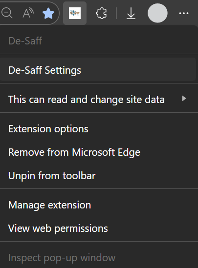

# De-Saff

## Main features

- Condense and hide an operator's updates if it becomes too much
- Hide repeated email chains across updates
- Hide attachments
- Completely hide status updates (opened / closed / custom fields)
- Fix Helpspot's dark mode: no more black text on a dark background
- Move through tickets in a queue with CTRL + ArrowKeys

## Contributing

More info [here](./CONTRIBUTING.md)

## Getting started

You can customize the behavior of the extension in the settings menu:

